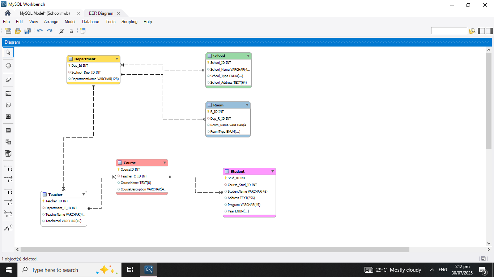

# Database-Management-School

## Description
This project demonstrates a complete Database Model setup using:
- **6 Primary Key**
- **5 Foreign Key**
- **25 Data Types**
- **Auto Increment**

The queries includes **Insert**, **Select**, **Update**, and **Delete** . Designed and Queried using **MySQL Workbench**, this setup is ideal for learning Table Creation and basic CRUD Operation.

---

## Project Objectives
- Perform CRUD Operation.
- Create Tables.
- Apply Data Types.
- Practice SQL Queries.

---

## Repository Contents

# Queries/
- **Customer.txt**
- **Food.txt**
- **Transaction.txt**

# Overview 

# Database Source File/
- **Database 3 (School Management).mbw**
  
# README.md

## Tools Used
- **MySQL Workbench** – for Queries and Design
- **Text Editor** – for writing and reviewing SQL Queries 

---

## How to Use
1. Open the `Database 3 (School Management)` file using **MySQL Workbench**.
2. Click the Forward Engineer.
3. Try perform SQL Queries and check if there's an error.

---

## Author
**[ITArchitect111](https://github.com/ITArchitect111)**  
BS in Information Systems – Isabela, Philippines  
**TikTok**: [@it_ako123](https://www.tiktok.com/@it_ako123)

---

## License
This project is provided for educational purposes only.  
Feel free to fork or adapt it with proper credit.
